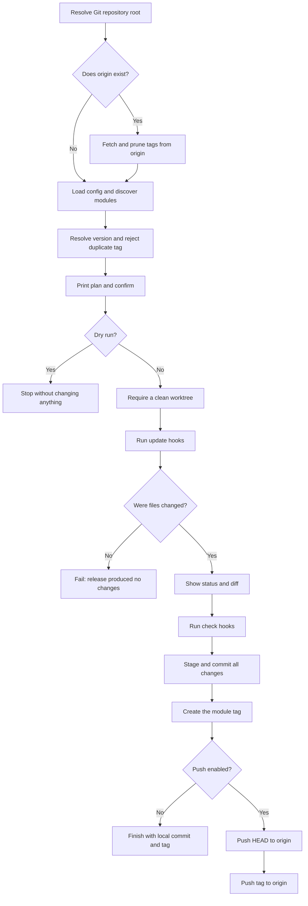

# modrel

`modrel` releases Go modules in single-module and multi-module repositories.

It discovers modules from `go.mod`, follows Go module tag conventions, and leaves project-specific version file updates to hooks.

## Install From Source

```bash
make install
```

This installs `modrel` to `$(go env GOPATH)/bin/modrel`.

## Commands

List discovered modules:

```bash
modrel list
```

Print the installed modrel version:

```bash
modrel version
```

Print a release plan:

```bash
modrel plan .
modrel plan examples/hello --type rc
modrel plan examples/hello --version v1.2.3
```

Apply a release:

```bash
modrel apply . --version v1.2.3
modrel apply examples/hello --type rc
modrel apply examples/hello --version v1.2.3 --dry-run --yes
modrel apply . --version v1.2.3 --push
```

The root command is a planning shortcut:

```bash
modrel .
```

When no path is provided, `modrel` prompts for a discovered module.

## Versions

Stable versions use:

```text
v1.2.3
```

RC versions use:

```text
v1.2.3-rc.1
```

Manual versions must include the leading `v` and must match one of:

```text
vMAJOR.MINOR.PATCH
vMAJOR.MINOR.PATCH-rc.N
```

## Tags

Root module tags:

```text
v1.2.3
v1.2.3-rc.1
```

Submodule tags:

```text
path/v1.2.3
path/v1.2.3-rc.1
```

Examples:

```text
v1.2.3
examples/hello/v1.2.3
examples/hello/v1.2.3-rc.1
```

## Configuration

Configuration is optional. Put `.modrel.yaml` at the git repository root.

```yaml
discovery:
  exclude:
    - "third_party/**"
    - "cmd/demo"

defaults:
  checks:
    - "go test ./..."

modules:
  ".":
    update:
      - 'sh "$MODREL_REPO_ROOT/scripts/release/update-version.sh" internal/buildinfo/version.go'
    commit: "release: {{ .Version }}"

  "examples/hello":
    update:
      - 'sh "$MODREL_REPO_ROOT/scripts/release/update-version.sh" version.go'
    checks:
      - "go test ./..."
    commit: "release(examples/hello): {{ .Version }}"
```

Without config, `modrel` uses:

```text
checks: go test ./...
root commit: release: <version>
submodule commit: release(<path>): <version>
```

`apply` requires release file changes. In normal use, provide an update hook that modifies the version file, `go.mod`, or other release metadata.

This repository uses that configuration for both its root module and the example module at `examples/hello`. Both modules keep their current release version in a Go `Version` constant. Their tags are `vX.Y.Z` and `examples/hello/vX.Y.Z`, respectively.

## Release Workflow

`plan` and `apply` first fetch tags from `origin` when that remote exists. This ensures version selection and duplicate-tag checks use the latest remote state.



Any failed update or check stops the release before the commit and tag are created. Changes already made by update hooks remain in the worktree for inspection.

## Hook Environment

Hooks run from the selected module directory and receive:

```text
MODREL_REPO_ROOT
MODREL_MODULE
MODREL_MODULE_DIR
MODREL_MODULE_PATH
MODREL_VERSION
MODREL_TAG
MODREL_LATEST_TAG
```

An update hook should validate its inputs, update only its intended file, fail when the expected source marker is missing, and replace the file atomically. For example:

```bash
#!/usr/bin/env bash
set -euo pipefail

: "${MODREL_MODULE_DIR:?MODREL_MODULE_DIR is required}"
: "${MODREL_VERSION:?MODREL_VERSION is required}"

version_file="$MODREL_MODULE_DIR/internal/buildinfo/version.go"
temporary_file="$version_file.tmp"
updated=false

trap 'rm -f "$temporary_file"' EXIT

while IFS= read -r line || [[ -n "$line" ]]; do
  if [[ "$line" =~ ^const[[:space:]]+Version[[:space:]]*= ]]; then
    printf 'const Version = "%s"\n' "$MODREL_VERSION"
    updated=true
  else
    printf '%s\n' "$line"
  fi
done < "$version_file" > "$temporary_file"

if [[ "$updated" != true ]]; then
  echo "Version constant not found in $version_file" >&2
  exit 1
fi

mv "$temporary_file" "$version_file"
trap - EXIT
```

The normal hook lifecycle is:

1. Enable strict Bash error handling.
2. Validate the required `MODREL_*` environment variables.
3. Resolve files from `MODREL_MODULE_DIR` or `MODREL_REPO_ROOT`.
4. Write the new content to a temporary file.
5. Verify that the intended value was actually updated.
6. Atomically replace the original file.
7. Let the configured check hooks validate the updated module.

## Safety Flags

```text
--dry-run   Print the plan without changing files, commits, tags, or remotes.
--yes       Skip confirmation prompts.
--push      Push the release commit and tag after creating them.
```
