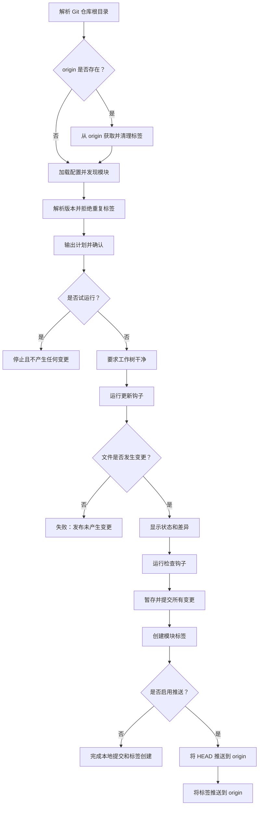

[English](README.md) | [简体中文](README.zh-CN.md)

# modrel

`modrel` 用于在单模块和多模块仓库中发布 Go 模块。

它从 `go.mod` 中发现模块，遵循 Go 模块标签规范，并通过钩子完成项目特定的版本文件更新。

## 从源码安装

```bash
just install
```

该命令会将 `modrel` 安装到 `$(go env GOPATH)/bin/modrel`。

## 命令

列出发现的模块：

```bash
modrel list
```

输出已安装的 modrel 版本：

```bash
modrel version
```

输出发布计划：

```bash
modrel plan .
modrel plan examples/hello --type rc
modrel plan examples/hello --version v1.2.3
```

执行发布：

```bash
modrel apply . --version v1.2.3
modrel apply examples/hello --type rc
modrel apply examples/hello --version v1.2.3 --dry-run --yes
modrel apply . --version v1.2.3 --push
```

根命令是生成发布计划的快捷方式：

```bash
modrel .
```

未提供路径时，`modrel` 会提示选择一个已发现的模块。

## 版本

稳定版本格式：

```text
v1.2.3
```

RC 版本格式：

```text
v1.2.3-rc.1
```

手动指定的版本必须以 `v` 开头，并匹配以下格式之一：

```text
vMAJOR.MINOR.PATCH
vMAJOR.MINOR.PATCH-rc.N
```

## 标签

根模块标签：

```text
v1.2.3
v1.2.3-rc.1
```

子模块标签：

```text
path/v1.2.3
path/v1.2.3-rc.1
```

示例：

```text
v1.2.3
examples/hello/v1.2.3
examples/hello/v1.2.3-rc.1
```

## 配置

配置是可选的。将 `.modrel.toml` 放在 Git 仓库根目录下。

```toml
[discovery]
excludes = ["third_party/**", "cmd/demo"]

[defaults]
checks = ["go test ./..."]

[modules."."]
updates = [
  'sh "$MODREL_REPO_ROOT/scripts/release/update-version.sh" internal/buildinfo/version.go',
]
commit = "release: {{ .Version }}"

[modules."examples/hello"]
updates = [
  'sh "$MODREL_REPO_ROOT/scripts/release/update-version.sh" version.go',
]
checks = ["go test ./..."]
commit = "release(examples/hello): {{ .Version }}"
```

没有配置时，`modrel` 使用以下默认值：

```text
checks: go test ./...
根模块提交信息: release: <version>
子模块提交信息: release(<path>): <version>
```

`apply` 要求发布过程产生文件变更。通常需要提供一个更新钩子，用于修改版本文件、`go.mod` 或其他发布元数据。

本仓库通过上述配置同时管理根模块和 `examples/hello` 示例模块。两个模块都使用 Go 的 `Version` 常量保存当前发布版本。对应标签分别为 `vX.Y.Z` 和 `examples/hello/vX.Y.Z`。

## 发布流程

当 `origin` 远端存在时，`plan` 和 `apply` 会先从中获取标签，确保版本选择和重复标签检查基于最新的远端状态。



任何更新或检查钩子失败，都会在创建提交和标签前中止发布。更新钩子已经产生的变更会保留在工作树中，以便检查。

## 钩子环境变量

钩子在选定的模块目录中运行，并接收以下环境变量：

```text
MODREL_REPO_ROOT
MODREL_MODULE
MODREL_MODULE_DIR
MODREL_MODULE_PATH
MODREL_VERSION
MODREL_TAG
MODREL_LATEST_TAG
```

更新钩子应验证输入，只更新目标文件，在找不到预期源码标记时失败，并以原子方式替换文件。例如：

```bash
#!/usr/bin/env bash
set -euo pipefail

: "${MODREL_MODULE_DIR:?MODREL_MODULE_DIR is required}"
: "${MODREL_VERSION:?MODREL_VERSION is required}"

version_file="$MODREL_MODULE_DIR/internal/buildinfo/version.go"
temporary_file="$version_file.tmp"
updated=false

trap 'rm -f "$temporary_file"' EXIT

while IFS= read -r line || [[ -n "$line" ]]; do
  if [[ "$line" =~ ^const[[:space:]]+Version[[:space:]]*= ]]; then
    printf 'const Version = "%s"\n' "$MODREL_VERSION"
    updated=true
  else
    printf '%s\n' "$line"
  fi
done < "$version_file" > "$temporary_file"

if [[ "$updated" != true ]]; then
  echo "Version constant not found in $version_file" >&2
  exit 1
fi

mv "$temporary_file" "$version_file"
trap - EXIT
```

标准钩子生命周期如下：

1. 启用 Bash 严格错误处理。
2. 验证必需的 `MODREL_*` 环境变量。
3. 从 `MODREL_MODULE_DIR` 或 `MODREL_REPO_ROOT` 定位文件。
4. 将新内容写入临时文件。
5. 验证目标值确实已更新。
6. 以原子方式替换原文件。
7. 由配置的检查钩子验证更新后的模块。

## 安全选项

```text
--dry-run   输出计划，不修改文件、提交、标签或远端。
--yes       跳过确认提示。
--push      创建发布提交和标签后将其推送到远端。
```
